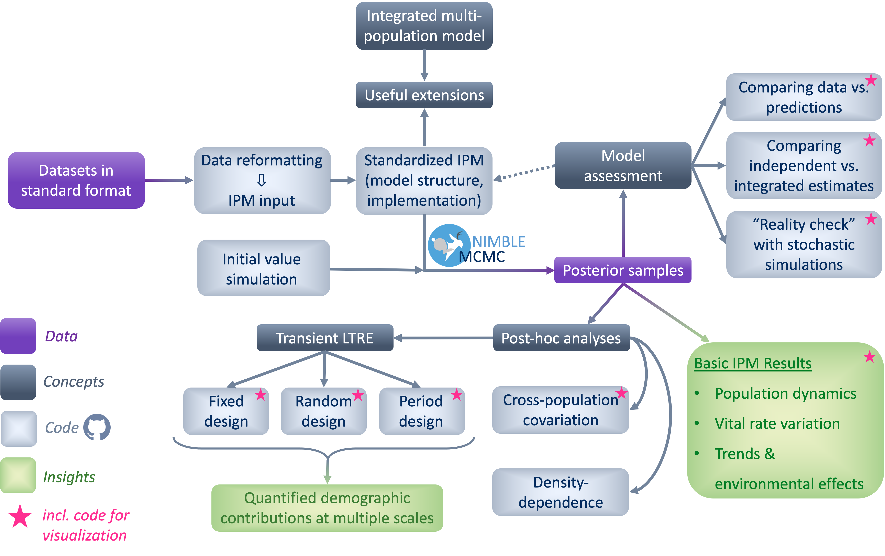

--- 
title: "SPI-IPM Code Manual"
author: "Chloé R. Nater"
date: "`r Sys.Date()`"
site: bookdown::bookdown_site
output: bookdown::gitbook
documentclass: book
bibliography: [book.bib, packages.bib]
biblio-style: apalike
link-citations: yes
#github-repo: rstudio/bookdown-demo
description: "TBA."
---

# About this manual {-}

This manual is intended as a user guide for the SPI-IPM repository (https://github.com/SPI-Birds/SPI-IPM). The repository contains an entire toolbox of code to implement, run, and analyse integrated population models (IPMs) using data hosted by the SPI-Birds Network and Database (https://spibirds.org).While code is designed to work directly with the SPI-Birds standard data format and the population model is tailored to hole-nesting bird species, both code and workflow can serve as a basis for extensions and applications to a wide range of other species and data types.

The increasing adoption of standard formats for ecological data opens new possibilities for (comparative) analyses at much larger spatial scales. Accessible, transparent, and reproducible tools and workflows are central to implementing such analyses. The idea behind SPI-IPM is to provide such tools and workflows for integrated analyses of population dynamics using Bayesian IPMs. 

IPMs have rapidly gained popularity over the past decade due to a range of advantages including efficient use of available data, thorough inclusion and propagation of uncertainty, and estimation of parameters for which no explicit data can be collected. To learn more about IPMs and their applications in general, see @plard2019 and @schaub2021. The use of IPMs with SPI-Birds data for identifying and quantifying the drivers of population dynamics (of pied flycatchers) is illustrated in the paper that gave rise to the SPI-IPM repository.  

This manual is organised into eight chapters that cover the entire workflow presented in Figure \@ref(fig:WorkflowDiag):

```{r WorkflowDiag, fig.cap='Schematic representation of the SPI-IPM workflow.', out.width='100%', fig.asp=.75, fig.align='center', echo = FALSE}

```

Chapter 1 describes how data obtained in the [SPI-Birds standard format](https://github.com/SPI-Birds/documentation/tree/master/standard_protocol) is reformatted for use in an IPM. Chapters 2 & 3 explain the structure and assumptions of the IPM, and chapter 4 details its implementation using the R package `nimble` [@devalpine2017]. Chapter 5 introduces ways for assessing model performance and fit and chapter 6 contains notes about visualizing results in different ways. A range of useful follow-up analyses (incl. tests for time trends and density dependence, perturbation analyses, etc.) are described in Chapter 7. The final chapter (8) is more of a teaser trailer than anything else, presenting a few ideas for future extensions and additional applications.

Relevant code for each chapter is deposited in subfolders in the [code repository](https://github.com/SPI-Birds/SPI-IPM/tree/main/SPI-IPM_Code) that start with the same number as the manual chapter. The repository README contains more details about where to find what. 


At present, this manual is incomplete in two ways. First, there are chapters for which content is still missing (marked with "TBA"). This content will be added throughout 2022. Second, and more importantly: neither the code repository nor the manual are exhaustive. They are meant to help others use and adapt SPI-IPM for their own studies and will hopefully keep growing as more people add their own extensions and new applications to the repository. 

### How to cite {-}
TBA
